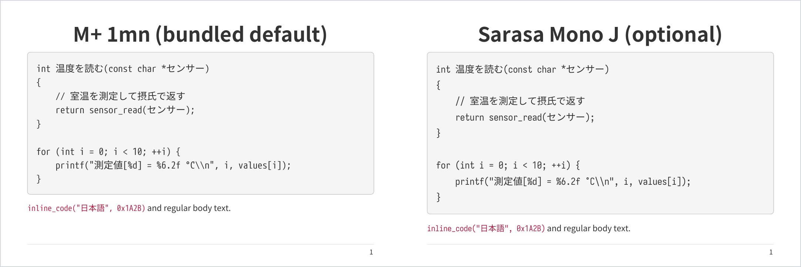

# Space Cubics PDF Builder

This repository is a template for creating PDF documents from AsciiDoc
sources with Asciidoctor PDF.

The included themes and cover designs are provided as Space Cubics samples.
Use them as they are, or adapt them to the requirements of your document.
The template produces a standard PDF and a print-friendly PDF whose cover
uses less solid-color fill.

The PDF toolchain is Ruby-based. Bundler can isolate Ruby gems inside this
repository under `vendor/bundle`. It is recommended, but optional: the build
can also use the active Ruby environment directly.

## Get a first PDF on Debian or Ubuntu

The documented setup uses Bundler to install the Ruby dependencies inside the
repository. Asciidoctor Mathematical includes a native extension, so install
its build requirements together with the tools and packaged fonts used by the
simple theme:

```sh
sudo apt update
sudo apt install \
  make ruby bundler git fonts-ipaexfont-gothic \
  ruby-dev build-essential cmake bison flex \
  libglib2.0-dev libgdk-pixbuf-2.0-dev libcairo2-dev libpango1.0-dev \
  libxml2-dev libffi-dev fonts-lyx
```

`fonts-lyx` supplies the Computer Modern and symbol TTF files used by the
equation renderer.

Clone the repository, keep its gems inside the clone, and build with the simple
theme:

```sh
git clone https://github.com/spacecubics/sc-pdf-builder.git
cd sc-pdf-builder
bundle config set --local path vendor/bundle
CMAKE_POLICY_VERSION_MINIMUM=3.5 \
CMAKE_GENERATOR="Unix Makefiles" \
bundle install
bundle exec make THEME=simple
```

This generates `build/SpaceCubics_PDF_revx.pdf`. The simple theme uses IPAex
Gothic from Debian for body text and M+ 1mn bundled with Asciidoctor PDF for
code. It is intended to make the first build dependable; the Space Cubics
design uses Noto Sans JP and Sarasa Mono J.

`bundle config set --local` writes the setting to `.bundle/config` in this
repository. Both `.bundle/` and `vendor/bundle/` are ignored by Git. No gems
are installed globally. Bundler-generated lock files are also local and
ignored by Git.

Mathematical's bundled CMake files declare compatibility with CMake 2.8.7,
which CMake 4 rejects. `CMAKE_POLICY_VERSION_MINIMUM=3.5` tells current CMake
to apply policies from version 3.5. Mathematical invokes `make` directly after
configuration, so `CMAKE_GENERATOR="Unix Makefiles"` ensures that CMake creates
the Makefiles its installer expects.

Bundler is optional. If you are familiar with Ruby development environments,
install the dependencies declared in `Gemfile` with rbenv, RVM, chruby, a
container, or another preferred workflow. The Makefile invokes Ruby and
Asciidoctor PDF directly, so run the same Make command inside that environment.

## Set up the Space Cubics design

A plain `make` uses the `sc-docs` theme. This is the intended Space Cubics
output:

- Noto Sans JP Regular and Bold for body text
- Sarasa Mono J Regular, Italic, Bold, and Bold Italic for code
- Asciidoctor Mathematical for equations

### Install Noto Sans JP

Debian does not package the standalone static TTF files required by Prawn.
Create Regular and Bold files from Noto's official variable TTF with Debian's
FontTools package:

```sh
sudo apt install curl python3-fonttools fontconfig
font_dir="${XDG_DATA_HOME:-$HOME/.local/share}/fonts"
mkdir -p "$font_dir"
curl -fL \
  -o /tmp/NotoSansJP-VF.ttf \
  https://raw.githubusercontent.com/notofonts/noto-cjk/Sans2.004/Sans/Variable/TTF/Subset/NotoSansJP-VF.ttf
python3 -m fontTools.varLib.instancer --update-name-table -q \
  -o "$font_dir/NotoSansJP-Regular.ttf" \
  /tmp/NotoSansJP-VF.ttf wght=400
python3 -m fontTools.varLib.instancer --update-name-table -q \
  -o "$font_dir/NotoSansJP-Bold.ttf" \
  /tmp/NotoSansJP-VF.ttf wght=700
fc-cache -f "$font_dir"
fc-match -f '%{file}\n' 'Noto Sans JP'
```

Debian's `fonts-noto-cjk` package installs `NotoSansCJK-Regular.ttc` and
`NotoSansCJK-Bold.ttc` under `/usr/share/fonts/opentype/noto`. Those TTC font
collections are not the standalone TTF files required by the theme, and Prawn
cannot use them directly.

### Install Sarasa Mono J

Sarasa Mono J is not available from Debian, RubyGems, or PyPI. Its upstream
project distributes release archives. The same PDF source rendered with M+
and Sarasa looks like this:



To use Sarasa, install its Japanese Mono TTF archive in your per-user font
directory. This example uses version 1.0.41; check the
[Sarasa Gothic releases](https://github.com/be5invis/Sarasa-Gothic/releases)
for a newer version.

```sh
sudo apt install curl 7zip
font_dir="${XDG_DATA_HOME:-$HOME/.local/share}/fonts"
mkdir -p "$font_dir"
curl -fL \
  -o /tmp/SarasaMonoJ-TTF-1.0.41.7z \
  https://github.com/be5invis/Sarasa-Gothic/releases/download/v1.0.41/SarasaMonoJ-TTF-1.0.41.7z
7z x -y /tmp/SarasaMonoJ-TTF-1.0.41.7z \
  -o"$font_dir"
fc-cache -f "$font_dir"
fc-match -f '%{file}\n' 'Sarasa Mono J'
```

The Makefile searches the current XDG user font directory, the legacy
`~/.fonts` directory, `/usr/local/share/fonts`, and Debian's IPAex Gothic
directory. Asciidoctor PDF does not search subdirectories. Override
`FONTS_DIR` when the font files are elsewhere; the supplied value replaces the
complete default search path. Include every directory needed by the selected
theme and separate them with semicolons:

```sh
make FONTS_DIR='/opt/fonts/noto;/opt/fonts/sarasa'
```

Prawn reads and embeds these files directly. Its fallback list supplies a
glyph that the selected, registered font does not contain. It cannot recover
from a missing file named in `font.catalog`; an absent catalog file stops the
build before text is rendered.

### Enable equations

The Gemfile includes Asciidoctor Mathematical, and the Makefile loads it for
every PDF build. Enable equation rendering in a document with:

```asciidoc
:stem: latexmath
:mathematical-format: svg
```

The included example enables both attributes. A document that does not set
`:stem:` builds normally without rendering equations.

## Build the included example

After completing the Space Cubics setup above, build the included example
with:

```sh
bundle exec make
```

The generated file is:

```text
build/SpaceCubics_PDF_revx.pdf
```

Other useful targets are:

```sh
make pdf       # standard PDF only
make pdf-print # print-friendly variant
make clean     # remove generated files
```

Make prints a `GEN` line for the rendered cover and PDF by default. Use `V=1`
to show the commands it runs instead:

```sh
bundle exec make V=1
```

### Print-friendly variant

Build the print-friendly PDF explicitly:

```sh
bundle exec make pdf-print
```

This generates `build/SpaceCubics_PDF_revx-print.pdf`. It has a white cover
with dark text and logo artwork, reducing toner or ink use. The standard PDF
has a dark cover with white text and logo artwork. The document body is the
same in both variants.

### Draft watermark

Set the build option `DRAFT` to place a translucent, diagonal `DRAFT`
watermark on every page, including the cover and table of contents:

```sh
bundle exec make DRAFT=1
bundle exec make pdf-print DRAFT=1
```

This works with both themes and with `document.mk`. Any non-empty `DRAFT`
value enables watermarking, including `0`.
Leave `DRAFT` unset or empty (`DRAFT=`) to disable it. The build option is the
sole control; no document attribute is needed or consulted. Changing `DRAFT`
automatically rebuilds the PDF; no clean is needed. The output filename stays
the same, so use `OUTPUT=document-draft` to keep a separate draft copy.

## Use the builder in a document repository

Clone the builder into your document repository:

```sh
git clone https://github.com/spacecubics/sc-pdf-builder.git
```

Create a `Makefile` in your document repository with the following contents.
Set `ADOC_SOURCE` and `IMAGES_DIR` to your document's paths.
The `document.mk` include supplies `pdf`, `pdf-print`, `pdf-setup`, and
`pdf-clean`.

```make
.DEFAULT_GOAL := pdf

ADOC_SOURCE := manual.adoc
IMAGES_DIR := images
PDF_BUILDER ?= sc-pdf-builder

include $(PDF_BUILDER)/document.mk

.PHONY: clean
clean: pdf-clean
```

After installing the system dependencies and fonts described above, run:

```sh
make pdf-setup
make pdf
make pdf-print
```

`pdf-setup` installs the builder's gems in `.bundle/pdf-gems/` within the
document repository. The PDF targets run Bundler automatically. Ignore
`.bundle/`, `build/`, and the builder checkout in the document repository's
`.gitignore`.

`document.mk` locates the builder from its own path. Set `PDF_BUILDER` to use
another checkout. Cloning and selecting the builder revision remain explicit
setup steps.

The include preserves an existing default goal. When the include precedes
all project targets, set `.DEFAULT_GOAL` explicitly or define a target after
it. The include does not define `all` or `clean`. Connect project cleanup to
`pdf-clean` as shown above. PDF builds share intermediate files, so the
include disables parallel recipes in the calling Makefile.

### Generated document sources

Keep source-generation rules in the document project. For example:

```make
.DEFAULT_GOAL := combined
ADOC_SOURCE := report/combined.adoc
IMAGES_DIR := report
OUTPUT := report

include sc-pdf-builder/document.mk

.PHONY: combined
combined: $(ADOC_SOURCE)

$(ADOC_SOURCE): $(PARTS)
	cat $(PARTS) > $@

pdf pdf-print: $(ADOC_SOURCE)
```

Define `PARTS` in document order. The PDF targets wait for the generated
source before invoking the builder.

### Build settings and dependencies

| Variable | Meaning | Default |
| --- | --- | --- |
| `PDF_BUILDER` | Builder checkout | Directory containing `document.mk` |
| `PDF_GEMS` | Local Bundler installation | `.bundle/pdf-gems` |
| `ADOC_SOURCE` | Entry-point file or directory containing `index.adoc` | `src/index.adoc` |
| `ADOC_RECURSIVE` | Set to `1` to scan nested source directories | `0` with `document.mk`, `1` for existing wrappers |
| `ADOC_DEPS` | Additional source dependencies, relative to the document project | Empty |
| `IMAGES_DIR` | Directory for document images | `images` |
| `OUTPUT` | PDF basename | Source basename without `.adoc`, or source directory name |
| `BUILD_DIR` | Generated-file directory | `build` |
| `FONTS_DIR` | Semicolon-separated font directories, replacing the complete search path | Builder's font search path |
| `THEME` | Theme basename | `sc-docs` |
| `DRAFT` | Add a `DRAFT` watermark to every page when non-empty | unset |

With `document.mk`, the builder tracks the entry point and `.adoc` files
immediately beside it.
For includes in subdirectories or other source assets, list the files in
`ADOC_DEPS` before including `document.mk`:

```make
ADOC_DEPS := $(wildcard chapters/*.adoc) data/measurements.csv
```

When migrating an existing wrapper to `document.mk`, declare nested
dependencies or set `ADOC_RECURSIVE := 1` to retain recursive scanning.
Files under `IMAGES_DIR` remain dependencies of both PDFs. Keep images in a
dedicated directory to avoid tracking generated output or installed gems.

Changing the source, dependency list, image or font directories, theme, or
`DRAFT` setting regenerates the PDF. The direct builder Makefile still
supports builds inside an active Ruby environment without Bundler.

## Start a document

The entry-point file holds the title, document settings, and chapter includes.
A minimal example is:

```asciidoc
= Hardware Manual
Space Cubics Inc.
v1.0, 1970-01-01
:product-name: My Product
:document-number: SC-DOC-001
:copyright-year: 2026
:doctype: book
:lang: ja
:toc:

== Introduction

Write your document here.
```

Use `include::chapter.adoc[]` to split a document into chapters. The sample in
`src/` demonstrates headings, text, figures, tables, code, equation syntax,
admonitions, and links. Rendered equations are shown when `:stem:` is enabled.

The builder loads its Japanese line-breaking extension for every PDF build.
Setting `:lang: ja` activates Japanese line-start, line-end, and inseparable
character rules. At a prohibited boundary, the extension uses push-out to move
the inseparable character sequence to the next line. It does not implement
character compression or hanging punctuation.

For a non-Japanese CJK document, omit `:lang: ja` and use Asciidoctor PDF's
generic CJK wrapping instead:

```asciidoc
:scripts: cjk
```

## Cover attributes

The cover renderer reads these attributes from the entry-point file:

| Attribute | Purpose | Special value |
| --- | --- | --- |
| `product-name` | Product or document family | |
| `document-number` | Document identifier | |
| `confidential-label` | Classification label | |
| `cover-footer-text` | Cover footer text | |
| `date` | Publication date, falling back to `revdate` | `BUILDDATE` uses today's date |
| `revision` | Document revision, falling back to `revnumber` | `GITHASH` uses the current Git revision |

The renderer reads the AsciiDoc header through Asciidoctor. A standard
revision line such as `v0.1, 2026-09-13` supplies `revnumber` (`0.1`) and
`revdate`. Explicit `date` and `revision` attributes override these values,
including when the attributes are empty. Header attribute references and
included header files follow Asciidoctor's parsing rules.

`GITHASH` gains a `-dirty` suffix when tracked files have uncommitted changes.
The PDF theme reads `copyright-year` directly for the page footer; it is not a
cover-renderer input.

## Customize the output

Edit `themes/sc-docs-theme.yml` to change typography, spacing, headers,
tables, code, and other page styles. The print theme inherits it from
`themes/sc-docs-print-theme.yml`.

Edit `images/cover-standard.svg.in` and `images/cover-print.svg.in` to change
the cover layout. Preserve placeholders such as `@DOCUMENT_NUMBER@`; the
build replaces them with document attributes.

## Run checks

Build the sample to check document integration with the actual PDF renderer:

```sh
bundle exec make pdf pdf-print
```

Run the Japanese line-wrap tests from the builder directory:

```sh
bundle exec ruby test/japanese_line_wrap_test.rb
```
